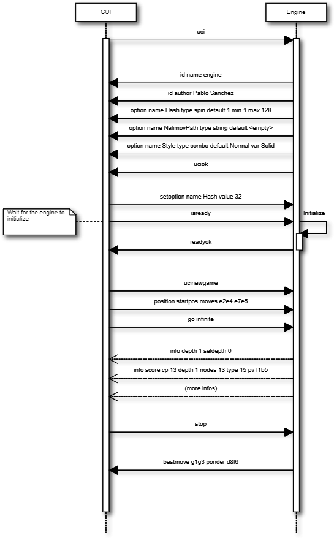

==================================================
Description of the universal chess interface (UCI)
==================================================

.. The original doc is really ugly, so here is my take on it

Note
----

This is not the original spec file. I took it, and transformed it into
something that I think is more readable.

The contents are the same with 2 exceptions:

* Engine to GUI > option > name is missing the defaults.
* The example at the end is a diagram instead of plaintext.

Spec
----

* The specification is independent of the operating system. For Windows, the
  engine is a normal exe file, either a console or "real" windows application.

* all communication is done via standard input and output with text commands,

* The engine should boot and wait for input from the GUI, the engine should
  wait for the "isready" or "setoption" command to set up its internal
  parameters as the boot process should be as quick as possible.

* the engine must always be able to process input from stdin, even while
  thinking.

* all command strings the engine receives will end with '\n', also all commands
  the GUI receives should end with '\n', Note: '\n' can be 0x0d or 0x0a0d or
  any combination depending on your OS. If you use Engine and GUI in the same
  OS this should be no problem if you communicate in text mode, but be aware of
  this when for example running a Linux engine in a Windows GUI.

* arbitrary white space between tokens is allowed Example: "debug on\n" and
  "   debug     on  \n" and "\t  debug \t  \t\ton\t  \n" all set the debug mode
  of the engine on.

* The engine will always be in forced mode which means it should never start
  calculating or pondering without receiving a "go" command first.

* Before the engine is asked to search on a position, there will always be
  a position command to tell the engine about the current position.

* by default all the opening book handling is done by the GUI, but there is an
  option for the engine to use its own book ("OwnBook" option, see below)

* if the engine or the GUI receives an unknown command or token it should just
  ignore it and try to parse the rest of the string in this line. Examples:
  "joho debug on\n" should switch the debug mode on given that joho is not
  defined, "debug joho on\n" will be undefined however.

* if the engine receives a command which is not supposed to come, for example
  "stop" when the engine is not calculating, it should also just ignore it.
  

Move format:
------------

The move format is in long algebraic notation.

A nullmove from the Engine to the GUI should be sent as 0000.
Examples:  e2e4, e7e5, e1g1 (white short castling), e7e8q (for promotion)

GUI to engine:
--------------

These are all the command the engine gets from the interface.

uci
~~~

Tell engine to use the uci (universal chess interface), this will be sent once
as a first command after program boot to tell the engine to switch to uci mode.

After receiving the uci command the engine must identify itself with the "id"
command and send the "option" commands to tell the GUI which engine settings
the engine supports if any. After that the engine should send "uciok" to
acknowledge the uci mode. If no uciok is sent within a certain time period, the
engine task will be killed by the GUI.

debug
~~~~~

**Parameters:** ``[ on | off ]``.

Switch the debug mode of the engine on and off.

In debug mode the engine should send additional infos to the GUI, e.g. with the
"info string" command, to help debugging, e.g. the commands that the engine has
received etc.

This mode should be switched off by default and this command can be sent any
time, also when the engine is thinking.

isready
~~~~~~~

This is used to synchronize the engine with the GUI. When the GUI has
sent a command or multiple commands that can take some time to
complete, this command can be used to wait for the engine to be ready
again or to ping the engine to find out if it is still alive.

E.g. this should be sent after setting the path to the tablebases as this can
take some time.

This command is also required once before the engine is asked to do any search
to wait for the engine to finish initializing.

This command must always be answered with "readyok" and can be sent also when
the engine is calculating in which case the engine should also immediately
answer with "readyok" without stopping the search.

setoption
~~~~~~~~~

**Parameters:** ``name <id> [value <x>]``

This is sent to the engine when the user wants to change the internal
parameters of the engine.

* For the "button" type no value is needed.
* One string will be sent for each parameter and this will only be sent when
  the engine is waiting.
* The name and value of the option in <id> should not be case sensitive and can
  inlude spaces.
* The substrings "value" and "name" should be avoided in <id> and <x> to allow
  unambiguous parsing, for example do not use <name> = "draw value".

Here are some strings for the example below:

::

    "setoption name Nullmove value true\n"
    "setoption name Selectivity value 3\n"
    "setoption name Style value Risky\n"
    "setoption name Clear Hash\n"
    "setoption name NalimovPath value c:\chess\tb\4;c:\chess\tb\5\n"

register
~~~~~~~~

This is the command to try to register an engine or to tell the engine that
registration will be done later. This command should always be sent if the
engine has sent "registration error" at program startup.

The following tokens are allowed:

* ``later``: the user doesn't want to register the engine now.
* ``name <x>``: the engine should be registered with the name ``<x>``
* ``code <y>``: the engine should be registered with the code ``<y>``

Example:

::

    "register later"
    "register name Stefan MK code 4359874324"

ucinewgame
~~~~~~~~~~

This is sent to the engine when the next search (started with "position" and
"go") will be from a different game.

This can be a new game the engine should play or a new game it should analyse
but also the next position from a testsuite with positions only.

If the GUI hasn't sent a "ucinewgame" before the first "position" command, the
engine shouldn't expect any further ucinewgame commands as the GUI is probably
not supporting the ucinewgame command. So the engine should not rely on this
command even though all new GUIs should support it.

As the engine's reaction to "ucinewgame" can take some time the GUI should
always send "isready" after "ucinewgame" to wait for the engine to finish its
operation.
   
position
~~~~~~~~

**Parameters:** ``[fen <fenstring> | startpos ]  moves <move1> .... <movei>``

Set up the position described in fenstring on the internal board and play the
moves on the internal chess board.

If the game was played from the start position the string "startpos" will be
sent Note: no "new" command is needed. However, if this position is from
a different game than the last position sent to the engine, the GUI should have
sent a "ucinewgame" inbetween.

go
~~

Start calculating on the current position set up with the "position" command.

There are a number of commands that can follow this command, all will be sent
in the same string. If one command is not sent its value should be interpreted
as it would not influence the search.

searchmoves
^^^^^^^^^^^

**Parameters:** ``<move1> .... <movei>``

Restrict search to this moves only

Example: After "position startpos" and "go infinite searchmoves e2e4 d2d4" the
engine should only search the two moves e2e4 and d2d4 in the initial position.

ponder
^^^^^^

Start searching in pondering mode.

Do not exit the search in ponder mode, even if it's mate!

This means that the last move sent in in the position string is the ponder
move. The engine can do what it wants to do, but after a "ponderhit" command it
should execute the suggested move to ponder on.

This means that the ponder move sent by the GUI can be interpreted as
a recommendation about which move to ponder. However, if the engine decides to
ponder on a different move, it should not display any mainlines as they are
likely to be misinterpreted by the GUI because the GUI expects the engine to
ponder on the suggested move.

wtime
^^^^^

**Parameters:** ``<x>``

White has x msec left on the clock

btime
^^^^^

**Parameters:** ``<x>``

Black has x msec left on the clock

winc
^^^^

**Parameters:** ``<x>``

White increment per move in mseconds if x > 0

binc
^^^^

**Parameters:** ``<x>``

Black increment per move in mseconds if x > 0

movestogo
^^^^^^^^^

**Parameters:** ``<x>``

There are x moves to the next time control, this will only be sent if x > 0.

If you don't get this and get the wtime and btime it's sudden death

depth
^^^^^

**Parameters:** ``<x>``

Search x plies only.

nodes
^^^^^

**Parameters:** ``<x>``
Search x nodes only,

mate
^^^^

**Parameters:** ``<x>``

Search for a mate in x moves

movetime
^^^^^^^^

**Parameters:** ``<x>``

Search exactly x mseconds

infinite
^^^^^^^^

Search until the "stop" command. Do not exit the search without being told so
in this mode!
    
stop
^^^^

Stop calculating as soon as possible, don't forget the "bestmove" and possibly
the "ponder" token when finishing the search

ponderhit
^^^^^^^^^

The user has played the expected move.

This will be sent if the engine was told to ponder on the same move the user
has played. The engine should continue searching but switch from pondering to
normal search.

quit
^^^^

Quit the program as soon as possible

Engine to GUI:
--------------

id
~~

Identify the engine.

name
^^^^

**Parameters:** ``<x>``

This must be sent after receiving the "uci" command to identify the engine,
e.g. "id name Shredder X.Y\n"

author
^^^^^^

**Parameters:** ``<x>``

This must be sent after receiving the "uci" command to identify the engine,
e.g. "id author Stefan MK\n"

uciok
~~~~~

Must be sent after the id and optional options to tell the GUI that the engine
has sent all infos and is ready in uci mode.

readyok
~~~~~~~

This must be sent when the engine has received an "isready" command and has
processed all input and is ready to accept new commands now.

It is usually sent after a command that can take some time to be able to wait
for the engine, but it can be used anytime, even when the engine is searching,
and must always be answered with "isready".

bestmove
~~~~~~~~

**Parameters:** ``<move1> [ ponder <move2> ]``

The engine has stopped searching and found the move ``<move>`` best in this
position.

The engine can send the move it likes to ponder on. The engine must not start
pondering automatically. This command must always be sent if the engine stops
searching, also in pondering mode if there is a "stop" command, so for every
"go" command a "bestmove" command is needed!

Directly before that the engine should send a final "info" command with the
final search information, the the GUI has the complete statistics about the
last search.

copyprotection
~~~~~~~~~~~~~~

This is needed for copyprotected engines. After the uciok command the engine
can tell the GUI, that it will check the copy protection now.

This is done by "copyprotection checking". If the check is ok the engine should
send "copyprotection ok", otherwise "copyprotection error". If there is an
error the engine should not function properly but should not quit alone. If the
engine reports "copyprotection error" the GUI should not use this engine and
display an error message instead!

The code in the engine can look like this:

::

    TellGUI("copyprotection checking\n");
    
    // ... check the copy protection here ...
    
    if(ok) {
       TellGUI("copyprotection ok\n");
    } else {
       TellGUI("copyprotection error\n");
    }
    
registration
~~~~~~~~~~~~

This is needed for engines that need a username and/or a code to function with
all features.

Analog to the "copyprotection" command the engine can send "registration
checking" after the uciok command followed by either "registration ok" or
"registration error".

Also after every attempt to register the engine it should answer with
"registration checking" and then either "registration ok" or "registration
error".

In contrast to the "copyprotection" command, the GUI can use the engine after
the engine has reported an error, but should inform the user that the engine is
not properly registered and might not use all its features.

In addition the GUI should offer to open a dialog to enable registration of the
engine. To try to register an engine the GUI can send the "register" command.

The GUI has to always answer with the "register" command if the engine sends
"registration error" at engine startup (this can also be done with "register
later") and tell the user somehow that the engine is not registered. This way
the engine knows that the GUI can deal with the registration procedure and the
user will be informed that the engine is not properly registered.
	      
info
~~~~

The engine wants to send information to the GUI.

This should be done whenever one of the info has changed. The engine can send
only selected infos or multiple infos with one info command, e.g. "info
currmove e2e4 currmovenumber 1" or "info depth 12 nodes 123456 nps 100000".

Also all infos belonging to the pv should be sent together e.g. "info depth
2 score cp 214 time 1242 nodes 2124 nps 34928 pv e2e4 e7e5 g1f3"

I suggest to start sending "currmove", "currmovenumber", "currline" and
"refutation" only after one second to avoid too much traffic.

Additional info:

depth
^^^^^

**Parameters:** ``<x>``

Search depth in plies

seldepth
^^^^^^^^

**Parameters:** ``<x>``

Selective search depth in plies, if the engine sends seldepth there must also
be a "depth" present in the same string.

time
^^^^

**Parameters:** ``<x>``

The time searched in ms, this should be sent together with the pv.

nodes
^^^^^

**Parameters:** ``<x>``

X nodes searched, the engine should send this info regularly

pv
^^

**Parameters:** ``<move1> ... <movei>``

The best line found

multipv
^^^^^^^

**Parameters:** ``<num>``

This is for the multi pv mode.

For the best move/pv add "multipv 1" in the string when you send the pv. in
k-best mode always send all k variants in k strings together.

score
^^^^^

One of:

* cp ``<x>``: the score from the engine's point of view in centipawns.
* mate ``<y>``: mate in y moves, not plies. If the engine is getting mated use
  negative values for y.
* lowerbound: the score is just a lower bound.
* upperbound: the score is just an upper bound.

currmove
~~~~~~~~

**Parameters:** ``<move>``

Currently searching this move

currmovenumber
~~~~~~~~~~~~~~

**Parameters:** ``<x>``

Currently searching move number x, for the first move x should be 1 not 0.

hashfull
~~~~~~~~

**Parameters:** ``<x>``

The hash is x permill full, the engine should send this info regularly

nps
~~~

**Parameters:** ``<x>``

X nodes per second searched, the engine should send this info regularly

tbhits
~~~~~~

**Parameters:** ``<x>``

X positions where found in the endgame table bases

sbhits
~~~~~~

**Parameters:** ``<x>``

X positions where found in the shredder endgame databases

cpuload
~~~~~~~

**Parameters:** ``<x>``

The cpu usage of the engine is x permill.

string
~~~~~~

**Parameters:** ``<str>``

Any string str which will be displayed be the engine, if there is a string
command the rest of the line will be interpreted as ``<str>``.

refutation
~~~~~~~~~~

**Parameters:** ``<move1> <move2> ... <movei>``

Move ``<move1>`` is refuted by the line ``<move2> ... <movei>``, i can be any
number >= 1.

Example: after move d1h5 is searched, the engine can send

::

    "info refutation d1h5 g6h5"

If g6h5 is the best answer after d1h5 or if g6h5 refutes the move d1h5.

If there is no refutation for d1h5 found, the engine should just send "info
refutation d1h5". The engine should only send this if the option
"UCI_ShowRefutations" is set to true.

currline
~~~~~~~~

**Parameters:** ``<cpunr> <move1> ... <movei>``

This is the current line the engine is calculating. ``<cpunr>`` is the number
of the cpu if the engine is running on more than one cpu.

:: 

    <cpunr> = 1,2,3....

If the engine is just using one cpu, ``<cpunr>`` can be omitted.

If ``<cpunr>`` is greater than 1, always send all k lines in k strings
together. The engine should only send this if the option "UCI_ShowCurrLine" is
set to true.
	

option
~~~~~~

This command tells the GUI which parameters can be changed in the engine.

This should be sent once at engine startup after the "uci" and the "id"
commands if any parameter can be changed in the engine.

The GUI should parse this and build a dialog for the user to change the
settings. Note that not every option needs to appear in this dialog as some
options like "Ponder", "UCI_AnalyseMode", etc. are better handled elsewhere or
are set automatically.

If the user wants to change some settings, the GUI will send a "setoption"
command to the engine.

Note that the GUI need not send the setoption command when starting the engine
for every option if it doesn't want to change the default value.

For all allowed combinations see the examples below, as some combinations of
this tokens don't make sense.

One string will be sent for each parameter.

name
^^^^

**Parameters:** ``<id>``

The option has the name id.

Certain options have a fixed value for ``<id>``, which means that the semantics
of this option is fixed.

Look for the original spec for details

.. I might add them latter, but i dont think so
   		
type
^^^^

**Parameters:** <t>

The option has type t.

There are 5 different types of options the engine can send:

check
  A checkbox that can either be true or false

spin
  A spin wheel that can be an integer in a certain range

combo
  A combo box that can have different predefined strings as a value

button
  A button that can be pressed to send a command to the engine

string
  A text field that has a string as a value, an empty string has the value
  "<empty>"

default
^^^^^^^

**Parameters:** ``<x>``

The default value of this parameter is x

min
^^^

**Parameters:** ``<x>``

The minimum value of this parameter is x

max
^^^

**Parameters:** ``<x>``

The maximum value of this parameter is x

var
^^^

**Parameters:** ``<x>``

A predefined value of this parameter is x

Examples: are 5 strings for each of the 5 possible types of options

::

    "option name Nullmove type check default true\n"
    "option name Selectivity type spin default 2 min 0 max 4\n"
    "option name Style type combo default Normal var Solid\n"
    "option name NalimovPath type string default c:\\n"
    "option name Clear Hash type button\n"

Examples:
---------

